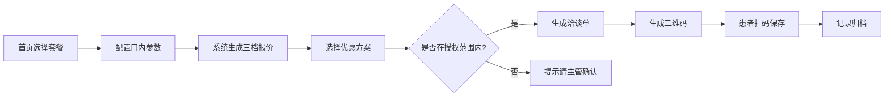

## 1. 产品概述

口腔咨询师平板端报价助手，解决洽谈室内患者听不懂套餐差异、咨询师临时算价易出错的痛点。通过场景化套餐卡片、参数化三档报价、授权内优惠调整、洽谈单扫码带走四大模块，提升咨询效率与专业信任。

- **目标用户**：口腔门诊咨询师（平板端横屏使用）
- **核心价值**：报价透明化、算价零失误、沟通高效化、承诺可追溯
- **使用场景**：洽谈室内，咨询师与患者面对面沟通时使用

## 2. 核心功能

### 2.1 用户角色

| 角色 | 使用方式 | 核心权限 |
|------|----------|----------|
| 咨询师 | 平板端登录使用 | 浏览套餐、配置报价、授权内优惠、生成洽谈单 |
| 患者 | 扫码查看洽谈单 | 查看报价明细、保存/分享洽谈单 |

### 2.2 功能模块

1. **首页套餐卡片**：四大场景套餐入口，快速进入报价配置
2. **报价详情页**：参数化配置 + 三档报价生成 + 话术解释
3. **优惠调整面板**：满减/分期/老客折扣，超出授权范围提示
4. **洽谈单生成**：一键生成、二维码展示、患者扫码带走

### 2.3 页面详情

| 页面名称 | 模块名称 | 功能描述 |
|----------|----------|----------|
| 首页 | 顶部导航 | 门诊名称、当前咨询师、返回/设置按钮 |
| 首页 | 场景套餐卡片 | 4张主套餐卡片（儿童涂氟窝沟封闭、成人洁牙美白、缺牙种植修复、隐形矫正评估），含图标、名称、价格区间 |
| 首页 | 快捷操作区 | 历史记录、常用模板、计算器快捷入口 |
| 报价详情页 | 患者信息栏 | 姓名、年龄、主诉（可快速填写） |
| 报价详情页 | 参数配置区 | 牙位数量选择器、材料档次切换、拍片选项、复诊维护选项 |
| 报价详情页 | 三档报价展示 | 经济款/标准款/尊享款三档并列展示，含价格、包含项、不含项、推荐话术 |
| 报价详情页 | 优惠调整入口 | 点击展开优惠面板 |
| 优惠调整面板 | 满减选项 | 预设档位满减，可选择但不可自定义金额 |
| 优惠调整面板 | 分期选项 | 3/6/12期分期方案，显示每期金额 |
| 优惠调整面板 | 老客转介绍折扣 | 9折/95折等预设折扣 |
| 优惠调整面板 | 超权限提示 | 超出授权范围时红色提示"请主管确认" |
| 洽谈单页 | 报价明细 | 项目明细、单价、数量、小计、优惠后总价 |
| 洽谈单页 | 二维码 | 患者扫码查看电子洽谈单 |
| 洽谈单页 | 操作按钮 | 打印、发送短信、保存记录 |

## 3. 核心流程

### 3.1 主要用户流程

咨询师打开平板 → 选择场景套餐 → 按患者口内情况配置参数（牙位/材料/拍片/复诊）→ 系统实时生成三档报价 → 咨询师选择优惠方案（授权范围内）→ 生成洽谈单 → 患者扫码保存 → 记录归档

### 3.2 流程图

## 4. 用户界面设计

### 4.1 设计风格

- **主色调**：深海蓝 (#1E5F8A) — 专业医疗信任感
- **辅助色**：薄荷绿 (#4ECDC4) — 清新亲和
- **强调色**：暖珊瑚 (#FF6B6B) — 优惠/警示
- **中性色**：象牙白 (#F7F7F2) 背景 + 深灰 (#2C3E50) 文字
- **按钮风格**：大圆角 (16px)、柔和阴影、点击态微缩效果
- **字体**：标题用思源黑体 Bold，正文用思源黑体 Regular，数字用等宽字体增强可读性
- **布局风格**：卡片式布局，左右分栏（左侧配置、右侧报价），平板横屏优化
- **图标风格**：线性图标，2px 描边，圆润端点

### 4.2 页面设计概览

| 页面名称 | 模块名称 | UI 元素 |
|----------|----------|---------|
| 首页 | 套餐卡片 | 大卡片、渐变图标、价格区间标签、悬浮微浮起 |
| 报价详情页 | 参数配置区 | 分段控制器、数字步进器、开关组件、牙位图选择 |
| 报价详情页 | 三档报价 | 三列等高卡片、中间标准款高亮、包含/不含列表、话术气泡 |
| 优惠调整面板 | 优惠选项 | 标签式选择、金额实时更新、超限红色警示边框 |
| 洽谈单页 | 二维码区 | 大尺寸二维码 + 淡入动画 + 有效期提示 |

### 4.3 响应式

- **设计优先级**：平板横屏优先（1024px ~ 1366px）
- **触控优化**：所有可点击元素 ≥ 48x48px，留足触控间距
- **横屏布局**：左右分栏，左侧参数配置（40%），右侧报价展示（60%）
- **字体适配**：使用 rem 单位，基础字号 18px，保证远距离可读

### 4.4 动效设计

- 页面切换：左右滑入滑出，模拟原生应用感
- 报价更新：数字滚动动画，价格变化时有过渡效果
- 套餐卡片：悬停/点击时轻微上浮 + 阴影加深
- 三档报价切换：高亮卡片平滑过渡
- 二维码生成：从中心扩散的淡入动画
