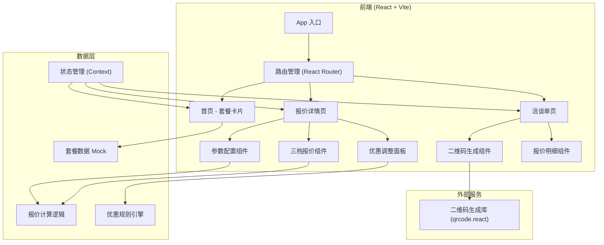

## 1. 架构设计



## 2. 技术描述

- **前端框架**：React@18 + TypeScript
- **构建工具**：Vite@5
- **样式方案**：TailwindCSS@3 + CSS 变量
- **路由管理**：react-router-dom@6
- **状态管理**：React Context + useReducer
- **二维码生成**：qrcode.react
- **图标库**：lucide-react
- **数据方案**：Mock 数据 + 本地计算，无后端依赖
- **动画**：CSS Transition + framer-motion

## 3. 路由定义

| 路由 | 页面 | 说明 |
|------|------|------|
| `/` | 首页 | 场景套餐卡片展示 |
| `/quote/:packageId` | 报价详情页 | 参数配置 + 三档报价 + 优惠调整 |
| `/consultation/:id` | 洽谈单页 | 报价明细 + 二维码展示 |

## 4. 数据模型

### 4.1 套餐数据模型

```typescript
interface Package {
  id: string;
  name: string;
  category: 'child' | 'adult' | 'implant' | 'orthodontics';
  description: string;
  icon: string;
  priceRange: {
    min: number;
    max: number;
  };
  configOptions: {
    toothCount?: { min: number; max: number; default: number };
    materials: MaterialOption[];
    includesXray: boolean;
    includesFollowUp: boolean;
  };
  tiers: QuoteTierConfig[];
}

interface MaterialOption {
  id: string;
  name: string;
  level: 'basic' | 'standard' | 'premium';
  basePrice: number;
  description: string;
}

interface QuoteTierConfig {
  id: string;
  name: string; // 经济款/标准款/尊享款
  tagline: string;
  multiplier: number; // 相对于基础价的倍率
  includes: string[];
  excludes: string[];
  salesPitch: string;
}
```

### 4.2 报价参数模型

```typescript
interface QuoteConfig {
  packageId: string;
  toothCount: number;
  materialId: string;
  includesXray: boolean;
  includesFollowUp: boolean;
}

interface QuoteResult {
  basePrice: number;
  tiers: QuoteTier[];
}

interface QuoteTier {
  id: string;
  name: string;
  tagline: string;
  totalPrice: number;
  originalPrice: number;
  includes: string[];
  excludes: string[];
  salesPitch: string;
}
```

### 4.3 优惠模型

```typescript
interface DiscountConfig {
  type: 'fullReduce' | 'installment' | 'referral';
  id: string;
  name: string;
  value: number;
  description: string;
  requiresManagerApproval: boolean;
}

interface FullReduceDiscount extends DiscountConfig {
  type: 'fullReduce';
  threshold: number;
  reduceAmount: number;
}

interface InstallmentDiscount extends DiscountConfig {
  type: 'installment';
  periods: number;
  interestRate: number;
}

interface ReferralDiscount extends DiscountConfig {
  type: 'referral';
  discountRate: number;
}
```

### 4.4 洽谈单模型

```typescript
interface ConsultationForm {
  id: string;
  createdAt: string;
  patientInfo: {
    name: string;
    age: number;
    complaint: string;
  };
  packageName: string;
  selectedTier: QuoteTier;
  discount: DiscountConfig | null;
  finalPrice: number;
  qrCodeUrl: string;
  expiresAt: string;
}
```

## 5. 目录结构

```
src/
├── assets/              # 静态资源
├── components/          # 公共组件
│   ├── layout/          # 布局组件
│   ├── ui/              # UI 基础组件（按钮、卡片、开关等）
│   └── tooth/           # 牙位选择相关组件
├── context/             # Context 状态管理
├── data/                # Mock 数据
│   └── packages.ts      # 套餐数据
├── hooks/               # 自定义 Hooks
│   ├── useQuote.ts      # 报价计算 Hook
│   └── useDiscount.ts   # 优惠计算 Hook
├── pages/               # 页面组件
│   ├── Home.tsx         # 首页
│   ├── QuoteDetail.tsx  # 报价详情页
│   └── Consultation.tsx # 洽谈单页
├── types/               # TypeScript 类型定义
├── utils/               # 工具函数
│   ├── calculator.ts    # 报价计算逻辑
│   └── format.ts        # 格式化工具
├── App.tsx
├── main.tsx
└── index.css
```

## 6. 核心计算逻辑

### 6.1 三档报价计算

```
基础价 = 材料单价 × 牙位数量 + 拍片费 + 复诊维护费

经济款总价 = 基础价 × 经济款倍率
标准款总价 = 基础价 × 标准款倍率
尊享款总价 = 基础价 × 尊享款倍率
```

### 6.2 优惠计算

- **满减**：满 X 减 Y，判断是否达到门槛
- **分期**：总价 ÷ 期数，显示每期金额
- **老客折扣**：总价 × 折扣率

### 6.3 权限判断

每种优惠方案标记 `requiresManagerApproval`，组合多种优惠时判断总优惠幅度是否超出阈值（如 >20%），超出则提示需主管确认。

